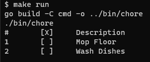

## Chores Tracker App

This is a simple CLI app that showcases different serialization methods for managing house chores.

## Serialization Methods

The serialization methods and RPC displayed in this application are:

- GOB
- Protocol Buffer
- JSON
- gRPC

It uses TLS for gRPC communication. It uses CFSSL for certificate generation.

## How to start the project locally

1. To run using protobuf as serializer

   `make compile`

   `make run`

   To pass args to the run command

   `make run add Mop Floor, Wash Dishes`

2. To run Rosie client and server communicating using gRPC

   `make gencert`

   On one terminal, start the server

   `make server`

   Open another terminal, start the client

   `make client`

   To pass args to the client

   ` make client add Mop Floor, Wash Dishes`
